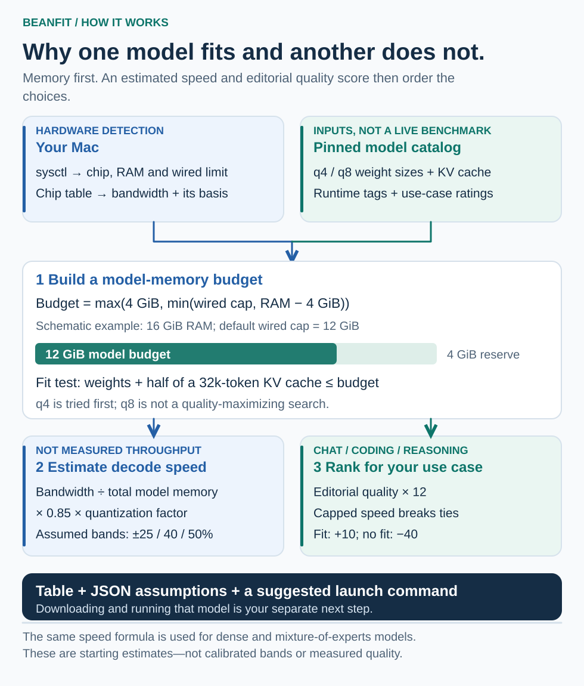

# BeanFit

Choose a local model and runtime for your Apple Silicon Mac. BeanFit detects
the device, estimates memory fit and speed, ranks model configurations, and
prints a command you can try.

**Not a benchmark:** speed is estimated, uncertainty bands are assumed rather
than calibrated, and quality scores are editorial. Dense and mixture-of-experts
models share a speed formula that does not model active-expert traffic. Treat
the recommendations as a starting point to measure on your machine.

Start here: [Run BeanFit](#install).

## From your Mac to a starting recommendation



The memory budget and catalog sizes meet at the fit test. Speed is a separate bandwidth-based estimate, and use-case ranking adds editorial quality and fit weights. The 16 GiB sketch is illustrative—not a benchmark. [Budget detection](src/beanfit/hw/macos.py) · [Speed model](src/beanfit/engine/estimate.py) · [Ranking](src/beanfit/engine/evaluate.py).

[Full-size diagram and editable SVG source](assets/readme-methods.svg).

## Install

Use Python 3.10+ from a source clone; there are no third-party runtime dependencies.
The package is not published to PyPI.

```bash
git clone https://github.com/stevekkall-beansgc/beanfit.git
cd beanfit
PYTHONPATH=src python3 -m beanfit
PYTHONPATH=src python3 -m beanfit --json
```

The table shows model, quantization, memory footprint, estimated speed and fit.
JSON includes the assumptions and claim limits. Running BeanFit does not run
model inference; separately executing a suggested Ollama command downloads
and runs a model.

## Five-minute showcase

Read the [CLI entry](src/beanfit/cli.py), then follow
[hardware detection](src/beanfit/hw/macos.py),
[ranking](src/beanfit/engine/evaluate.py) and
[estimation](src/beanfit/engine/estimate.py). The
[quality basis](docs/QUALITY-BASIS.md) explains the legacy ratings and their
unknown assignment history.

Check the behavior without model downloads:

```bash
PYTHONPATH=src python3 -m unittest discover -s tests -q
python3 scripts/offline_e2e.py
```

[CLI fixtures](tests/test_cli.py) and
[hardware fixtures](tests/test_hw_macos.py) make those paths inspectable.
[The detailed guide](README-REFERENCE.md) retains the shortened fixture
transcript, catalog controls, supported scope and development commands.

## Current source candidate

Source package identity is `0.6.1`; matching tags and GitHub Releases provide
release proof. Historical `v0.5.1` embeds `0.5.0`; those published artifacts
are unchanged. [Release history](https://github.com/stevekkall-beansgc/beanfit/releases)
and the [roadmap](ROADMAP.md) distinguish shipped source from planned
cross-platform detection and stack configuration.

Catalog liveness is point-in-time, with no automatic release-gate integration.
A receipt requires a clean checkout of the exact release commit and records the
SHA-256 of `scripts/validate_catalog.py`; the
[catalog guide](README-REFERENCE.md#honesty-policy) explains the live check.
Liveness is not performance evidence. This version has no telemetry.

## Related prototypes

The [activation package](docs/activation/README.md) is synthetic-only and
separate from the fit estimates. The
[mobile selector](examples/mobile/README.md) imports measurements rather than
running models on an iPhone. [BeanFit Pocket](iphone/README.md) is a native
prototype with separate device and integration gates.

See [CONTRIBUTING.md](CONTRIBUTING.md), [SECURITY.md](SECURITY.md) and
[AGENTS.md](AGENTS.md) for development and reporting.
